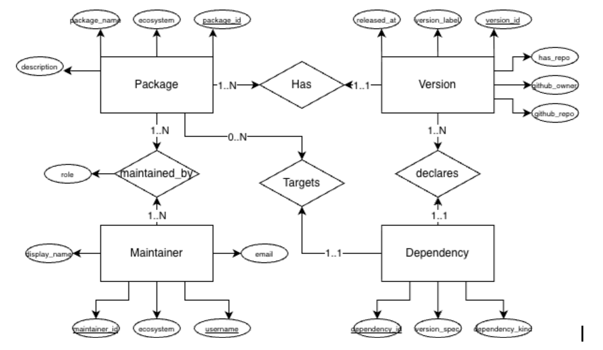

# Software Supply Chain Risk Scorer — Plan & Roadmap

> Living planning document for the CIS 5500 final project. Keep this in sync with reality — if a milestone slips, an owner changes, or scope moves, update the relevant section in the same PR that causes the change.

**Team:** Albert Chen, Kimberly Liang, Varun Chitturi, Nikita Mounier
**Course:** CIS 5500 (Databases & Information Systems), Spring 2026
**Repo:** `albert239825/software-supply-chain-risk-calculator`
**Last updated:** 2026-04-18

---

## 1. One-line summary

A web app that lets security teams explore the NPM package ecosystem via an interactive dependency graph and a composite risk score, backed by a normalized PostgreSQL database (Supabase) populated from the NPM registry.

**Target users:** security engineers auditing dependency risk; open-source watchdogs analyzing ecosystem-wide exposure.

---

## 2. Scope for v1 (what we will ship)

**In scope**
- **Ecosystem:** NPM only. PyPI code paths in the scraper are preserved but unused in the UI.
- **Data source:** pre-seeded Supabase Postgres populated by `collect_data.py --npm`. No live registry fetching at request time.
- **Projects / "upload" UX:** users pick packages already in our DB (search + multi-select) to form a "project." Live `package.json` parsing is a stretch feature (see §10).
- **Risk score:** composite over the 5 signals available in-DB today (no GitHub API). Fixed weights, fully explainable, documented in §7.
- **Pages (4):** Home, Graph Explorer, Risk Analysis & Breakdown, Package Detail. See §6.

**Out of scope for v1 (documented for honesty, not abandoned)**
- Anomaly detection & alerting
- Risk-minimization recommendations
- Historical comparison / snapshots
- PyPI surface in the UI
- GitHub-API-derived signals (repo activity, issue velocity, etc.)
- Live transitive resolution of user-uploaded `package.json`
- Authenticated users / saved projects across sessions

---

## 3. Milestones (CIS 5500 calendar)

| # | Deliverable | Date | Status | Notes |
|---|-------------|------|--------|-------|
| M1 | Project proposal | Feb 16 | Done | Submitted |
| M2 | Project outline (schema, DDL, tech stack, responsibilities) | Mar 6 | Done | Submitted |
| M3 | DB population on Supabase + 10 SQL queries | Mar 30 | Done | See `docs/queries/` (to be added from the M3 PDF) |
| **M4** | **API spec + mentor check-in (backend testable)** | **Apr 20 (Mon)** | **In progress — 2 days out** | See §4 sprint plan |
| M5 | Final report (6–10 pp) + demo video (2–4 min) + code zip | May 8 (Fri) | Not started | Live demo window May 4–May 8 |

Rubric highlights to not forget:
- Database must be in **3NF or BCNF**; proof goes in final report.
- **≥10 SQL queries**, **≥4 complex**, **≥2 complex with >15s pre-optimization and <1s post-optimization** (benchmarked before vs. after indexes/rewrites). Table of before/after timings required in final report.
- **Every non-auxiliary API route must map to one of those queries.**
- Multiple distinct pages with "meaningfully different" functionality.
- Guidelines specify AWS RDS; we are using Supabase (also Postgres). **Open question:** confirm with project mentor at M4 check-in (§9).

---

## 4. 48-hour sprint to M4 (Apr 18 → Apr 20)

Goal: enter the M4 check-in with a written API spec and a Next.js app that demonstrably hits Supabase and renders at least one page backed by one of our 10 queries.

| # | Task | Owner | ETA | Done when |
|---|------|-------|-----|-----------|
| 4.1 | Scaffold Next.js + TypeScript + Tailwind app at repo root (`app/` or `web/`) with Supabase JS client wired to env vars | TBD | Apr 18 eve | `npm run dev` serves a page that reads from Supabase |
| 4.2 | Lock in project directory layout (`web/`, `docs/`, existing scraper at root) and document in README | TBD | Apr 18 eve | README updated, one PR |
| 4.3 | Draft API specification covering ≥10 routes — one per M3 query — plus auxiliary routes (search, project CRUD in-memory) | TBD | Apr 19 | `docs/api-spec.md` merged; each route has path, method, params, response shape |
| 4.4 | Implement 1–2 end-to-end routes against Supabase for the mentor demo (recommend: `/api/packages?q=` for search, `/api/packages/:id/risk` for the baseline composite) | TBD | Apr 19 | Route returns JSON from real Supabase data |
| 4.5 | Implement at minimum a functional Home page wired to route 4.4 (list top-N risky packages from Q10) | TBD | Apr 20 AM | Page renders real rows |
| 4.6 | Prepare 5-slide / walkthrough script for the 15-min mentor call: problem, schema, M3 query samples, M4 routes, what's next for M5 | TBD | Apr 20 AM | Script in `docs/mentor-checkin-apr20.md` |
| 4.7 | Ask mentor: (a) Supabase vs AWS RDS, (b) does our 4-entity NPM schema satisfy the "two overlapping datasets" rule, (c) sanity-check complex-query targets | Albert | Apr 20 meeting | Answers captured in §9 decisions log |

If anything in §4.1–4.5 slips, cut 4.5 first (show the API via `curl` / a REST client in the check-in), then 4.4.

---

## 5. Workstreams & owners (for the rest of the semester)

Owners marked `TBD` — please claim lanes on the PR that lands this doc. "Lead" = single accountable person; "support" = secondary reviewer. One person can lead at most two lanes.

| Workstream | Lead | Support | What it covers |
|------------|------|---------|----------------|
| Data & DB | TBD | TBD | Supabase admin, schema maintenance, ingestion from scraper CSVs, index design, query optimization (the >15s → <1s work), 3NF/BCNF proof for final report |
| Backend / API | TBD | TBD | Next.js API routes under `web/app/api/`, Supabase query layer, API spec doc, request validation, pagination |
| Frontend | TBD | TBD | Next.js pages (§6), Tailwind styling, shared components (tables, search, loading states), dependency-graph visualization |
| Risk scoring | TBD | TBD | Signal definitions, composite formula, per-signal breakdown endpoint, UI explanations. Spans DB + backend. |
| Ingestion / scraper | TBD | TBD | Owns `collect_data.py` and `src/`. Runs a refreshed top-N scrape on demand for Supabase loads. |
| Report + demo + infra | TBD | TBD | Final report sections, demo video script + recording, README, keeps this `PLAN.md` current, schedules mentor/demo meetings |

**Rules of the road**
- All PRs touching `docs/PLAN.md` require one non-author review so everyone sees scope/ownership changes.
- Mark your WIP clearly in PR titles (`[wip]`) until CI passes.
- Before M5 freeze: every query in the app must have a corresponding API route + page surface, and the complex-query performance table (§8) must be filled in with real numbers.

---

## 6. Pages (v1)

Each page must have meaningfully different functionality per the rubric. All pages read from Supabase via backend API routes; no page queries Supabase directly from the client.

| # | Page | Path | Purpose | Backed by queries |
|---|------|------|---------|-------------------|
| 1 | **Home / Overview** | `/` | High-level ecosystem view: top-N most depended-on packages, top-N highest risk, counts of packages / versions / maintainers. Entry point for searching a package. | Q1 (packages + versions), Q5 (most depended-on), Q10 (multi-signal risk) |
| 2 | **Dependency Graph Explorer** | `/graph/:packageId` | Interactive visualization of the transitive dependency tree for a chosen package. Nodes colored by risk score. Click/hover for details. Controls for max depth and high-risk highlighting. | Q3 (recursive BFS), Q2 (counting deps), Q8 (depth-bounded walk) |
| 3 | **Risk Analysis & Breakdown** | `/risk/:packageId` | Per-package composite risk, per-signal bars, peer comparison (similar fan-out / fan-in bucket), table of that package's dependencies sorted by risk. | Q4 (low-maintainer staleness), Q7 (abandoned popular), Q10 (composite) |
| 4 | **Package Detail** | `/package/:packageId` | Single-package reference page: versions table, maintainers list, repo presence flag, direct dependencies, direct dependents. Links to pages 2 and 3. | Q1, Q2, Q5, Q6 (maintainer reach), Q9 (no-repo flag) |

Nav: top bar with Home / search. Search is a cross-cutting component, not a page.

**Page-to-query coverage check:** Q1–Q10 are all surfaced by at least one page. Good for the rubric.

---

## 7. Risk scoring (v1 spec — for team discussion)

### Signals (no GitHub API)

All five are computable from the current schema:

| ID | Signal | Source | Direction | Notes |
|----|--------|--------|-----------|-------|
| S1 | Maintainer count | `maintainers` | Lower → higher risk | Bus-factor proxy. Threshold candidate: ≤2 maintainers = high risk (mirrors Q4) |
| S2 | Release staleness | `MAX(versions.released)` per package | Older → higher risk | Years since last release. Candidate: ≥2y = high risk (mirrors Q7) |
| S3 | Dependency fan-out | `COUNT(dependencies WHERE from_package = p)` on latest version | Higher → higher risk | Attack surface proxy |
| S4 | Dependency fan-in (dependents) | `COUNT(dependencies WHERE to_package = p)` | Higher → higher *ecosystem* risk | High dependent count = blast radius, not intrinsic risk. Treated as a secondary, separately-displayed signal. |
| S5 | Repository presence | `versions.has_repository` | Missing → higher risk | Transparency proxy (mirrors Q9) |

### Composite formula (v1, placeholder weights — to be discussed)

```
normalized(signal) ∈ [0, 1]   # min-max normalized over all NPM packages in DB
composite_risk  = 0.30 * S1_norm   # maintainer sparsity
                + 0.30 * S2_norm   # staleness
                + 0.20 * S3_norm   # fan-out
                + 0.10 * S5_norm   # no repo
                + 0.10 * S4_norm   # blast radius
                                   # (shown separately in UI; included in composite so popular abandoned packages surface)
```

**Weights are placeholders.** Team to ratify or adjust in the M4-week planning meeting. Write final weights + rationale into the final report. The current M3 Q10 ad-hoc formula (`0.4 * deps + 0.3 * (2 - maintainers) + 0.3 * age_years`) is close enough for M4 demo; swap to the normalized version above once S4/S5 are added.

### UI requirements

- Per-package page shows each signal value, its normalized contribution, and the weight, so the score is fully explainable.
- Never display the composite without the per-signal breakdown next to it.
- Thresholds for "low / medium / high" buckets are fixed up front (documented in code + report), not learned.

---

## 8. Database & query plan

### Entities (per existing ER diagram)



Five relations already implemented in Supabase:

- `packages (id PK, ecosystem, name, description, latest_version)` — unique on `(ecosystem, name)`
- `versions (id PK, package_id FK, ecosystem, package_name, version, released, has_repository, github_owner, github_repo)` — unique on `(ecosystem, package_name, version)`
- `dependencies (id PK, ecosystem, from_package, from_version, to_package, version_spec, dep_kind, from_version_id FK, to_package_id FK)`
- `maintainers (id PK, ecosystem, package_name, package_id FK, username, name, role, email)`

Normalization target: **3NF** (confirm BCNF for final-report proof — Data & DB lead owns writeup).

### 10 M3 queries — status

Copy of M3 PDF to land at `docs/queries/m3-queries.md` (owner: Report + demo lane). The application must include an API route mapped to each.

| Query | Title | Complex? | Target runtime | Owns route |
|-------|-------|----------|----------------|------------|
| Q1 | Packages and versions | No | fast | Package Detail |
| Q2 | Direct dependency counts | No | fast | Graph Explorer, Package Detail |
| Q3 | Recursive dependency traversal (BFS) | **Yes** | **>15s pre → <1s post** | Graph Explorer |
| Q4 | Low-maintainer stale packages | No | fast | Risk Analysis |
| Q5 | Most depended-on packages | No | fast | Home |
| Q6 | Maintainers with most packages | No | fast | Package Detail |
| Q7 | Abandoned but popular | **Yes** | **>15s pre → <1s post** | Risk Analysis |
| Q8 | Depth-bounded dependency walk | **Yes** | target >15s pre → <1s post | Graph Explorer |
| Q9 | Packages without repos | No | fast | Package Detail |
| Q10 | Multi-signal risk scoring | **Yes** | target >15s pre → <1s post | Home, Risk Analysis |

### Query optimization plan (M4 → M5)

The rubric requires **≥2 complex queries with >15s pre-optimization and <1s post-optimization**. Q3 has already been observed to take that long on Supabase at depth ≥several.

| Technique | Where it helps |
|-----------|---------------|
| `CREATE INDEX` on `dependencies(from_version_id)`, `dependencies(to_package_id)` | Q2, Q3, Q5, Q7, Q8 |
| `CREATE INDEX` on `versions(package_id, released DESC)` | Q4, Q7, Q10 |
| `CREATE INDEX` on `maintainers(package_id)` | Q4, Q6, Q10 |
| Materialized view for "latest version per package" | Q3, Q8 (avoids the `v.version = p.latest_version` join) |
| Rewrites: replace `::text` casts in joins with typed columns; replace BFS with a `CYCLE`-aware `WITH RECURSIVE`; LIMIT frontier | Q3, Q8 |
| Caching layer (Next.js route segment cache / React cache) for hot reads on Home | Q5, Q10 |

Record before/after timings as each optimization lands. A running table lives at `docs/query-optimization-log.md` (create when first measurement is taken).

---

## 9. Open questions / decisions log

Add one row per decision. Keep the whole history — do not delete resolved rows, just update Status.

| # | Question | Raised | Owner | Status | Decision |
|---|----------|--------|-------|--------|----------|
| D1 | Supabase vs AWS RDS — guidelines say RDS | Apr 18 | Albert | Open | Ask at M4 mentor check-in Apr 20 |
| D2 | Does our 4-entity NPM-only schema satisfy the "two large overlapping datasets, ≥100k rows each" rule? | Apr 18 | Albert | Open | Ask at M4 mentor check-in Apr 20 |
| D3 | What ER (entity resolution) effort do we claim in the final report? (Candidates: deduping maintainers across packages, reconciling `package.json` repo URLs to GitHub owner/repo, unifying package name normalization across ecosystems.) | Apr 18 | Data & DB lead | Open | Draft a proposal before the mentor meeting |
| D4 | Final weights for the composite risk score (§7) | Apr 18 | Risk scoring lead | Open | Ratify in Apr-week team meeting |
| D5 | Directory layout: `web/` vs `app/` vs repo-root Next.js | Apr 18 | Backend lead | Open | Decide in sprint task 4.2 |
| D6 | Deployment for the demo: local only, Vercel preview, or Supabase-hosted? | Apr 18 | Report + demo lead | Open | Can wait until after M4 |
| D7 | Cut features (anomaly, minimization, historical, PyPI, live resolution) — keep as "stretch" or fully drop from the report's "future work" section? | Apr 18 | Team | Open | Decide before final report outline |

---

## 10. Stretch / post-v1 (not on the critical path)

These are tracked so we don't forget them, and so they appear in the "future work" section of the final report. **Do not start any of them until all §3 M5 deliverables are green.**

1. **Historical comparison**: versioned snapshots per project, "what changed since last scan" diff view.
2. **Anomaly detection**: flag newly introduced transitive deps; alert when a deep dep appears that wasn't in the previous snapshot.
3. **Risk-minimization recommendations**: rank direct-dep version bumps by impact on composite risk vs. number of transitive changes.
4. **PyPI surface**: the scraper already supports PyPI; add an `ecosystem` toggle in the UI and a second seed load.
5. **GitHub-derived signals**: issue/PR velocity, recent commit frequency, maintainer recency. Requires a GitHub PAT and rate-limit handling.
6. **Live `package.json` upload**: parse user upload → live-resolve from NPM registry on cache miss → write back to Supabase.
7. **User accounts / saved projects**: Supabase Auth, per-user project lists, sharing.

---

## 11. How to use this document

- Add your name to the owner cells in §5 on the PR that introduces you to the lane.
- When a decision is made in §9, **don't delete the row** — update Status and append the outcome. The final report will reference this log.
- If scope changes (add/cut a page, add/cut a signal), amend §2 and §6/§7 in the *same* PR as the change.
- If a milestone slips, update §3/§4 with the new date and a one-line reason. No silent slippage.
